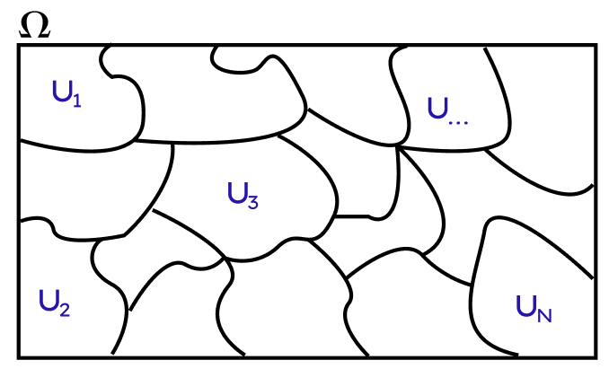

```{r setup, include=FALSE}
knitr::opts_chunk$set(echo = FALSE)
```

# Introducción

Considerando la distribución de muestreo de un estimador: $\overline{y}_c$: Valores posibles del estimador $P_c$ : Probabilidad de materialización del estimador c

La media de la distribución de muestreo es el valor esperado(la esperanza matemática) del estimador:

$$\displaystyle E(\overline{y})= \sum_{c}{P_c\overline{y}_c}$$

$\displaystyle E(\overline{y})-\overline{Y}$ : Sesgo de muestreo

Considerando si el estimador es insesgado, sucedería lo sgte para toda la distribución muestral del estimador: Si $$\displaystyle E(\overline{y})-\overline{Y}=0 \rightarrow E(\overline{y})= \overline{Y}$$

Desviación Estandar (Error Estándar): La raíz cuadrada de la varianza de la distribución de muestreo del estimador, que también es la desviación cuadrática media alrededor de la media $E(\overline{y})$ :

$$
\displaystyle Var(\overline{y}) =  \sum_{c}{P_c[y_c-E(\overline{y})]^2} \quad S(\overline{y})=\sqrt{Var(\overline{y}})
$$

Error Cuadrático Medio de la distribución de muestreo se relaciona con la varianza, pero en este las desviaciones se toman alrededor del valor $\overline{Y}$

$$
\displaystyle ECM(\overline{y})=\sum_{c}{P_c(\overline{y}_c-\overline{Y})^2}=Var(\overline{y})+[E(\overline{y})-\overline{Y}]^2
$$

EL termino adicional $[E(\overline{y})-\overline{Y}]^2$ es el cuadrado del sesgo de muestreo, este se anula en los diseños de muestreo insesgados. Y si no es cero, el sesgo de muestreo es pequeño para la mayoría de las muestras bien diseñadas, y tiende a disminuir conforme aumenta el tamaño de la muestra.

La inferencia estadística se base a errores estándares de la forma de intervalos:

$$
[\overline{y} \pm t_ps(\overline{y})]
$$

En el **Muestreo Probabilistico** cada elemento dela población tiene una probabilidad conocida y no nula de ser seleccionada.

+-----------+---------------------------------------------------------------------------------------------------------------------------------+-----------------------------------------------------------------------------------------------------------------------------------------------------------------------------+
| I         | ***Mesip (Métodos de Selección con Igual Probabilidad)*** para todos los elementos:                                             | ***Probabilidades desiguales*** para elementos diferentes; compensadas generalmente con ponderaciones inversas.                                                             |
|           |                                                                                                                                 |                                                                                                                                                                             |
|           | a\) Probabilidades iguales en todas las etapas                                                                                  | a\) Causadas por irregularidades en los marcos y los procedimientos de selección                                                                                            |
|           |                                                                                                                                 |                                                                                                                                                                             |
|           | b\) Probabilidades totales iguales para todos los elementos, obtenidas compensando probabilidades desiguales en diversas etapas | b\) Afijación o Asignación desproporcional diseñada para una asignación óptima                                                                                              |
+-----------+---------------------------------------------------------------------------------------------------------------------------------+-----------------------------------------------------------------------------------------------------------------------------------------------------------------------------+
| II        | ***Muestreo de elementos***: en una sola etapa, la unidad de muestreo contiene solamente un elemento                            | ***Muestreo de conglomerados***: las unidades de muestreo son conglomerados de elementos                                                                                    |
|           |                                                                                                                                 |                                                                                                                                                                             |
|           |                                                                                                                                 | a\) Muestreo de conglomerados en una etapa                                                                                                                                  |
|           |                                                                                                                                 |                                                                                                                                                                             |
|           |                                                                                                                                 | b\) Submuestreo o muestreo polietápico                                                                                                                                      |
|           |                                                                                                                                 |                                                                                                                                                                             |
|           |                                                                                                                                 | c\) Conglomerados iguales                                                                                                                                                   |
|           |                                                                                                                                 |                                                                                                                                                                             |
|           |                                                                                                                                 | d\) Conglomerados desiguales                                                                                                                                                |
+-----------+---------------------------------------------------------------------------------------------------------------------------------+-----------------------------------------------------------------------------------------------------------------------------------------------------------------------------+
| III       | ***Selección no estratificada:*** las unidades de muestreo seleccionadas de la población completa                               | ***Muestreo estratificado***: selecciones separadas de particiones,característica o estratos de la población.                                                               |
+-----------+---------------------------------------------------------------------------------------------------------------------------------+-----------------------------------------------------------------------------------------------------------------------------------------------------------------------------+
| IV        | ***Selección aleatoria*** de unidades individuales de muestreo de estrato completo o de la población                            | ***Selección sistemática*** de unidades de muestreo con un intervalo de selección aplicado a una lista                                                                      |
+-----------+---------------------------------------------------------------------------------------------------------------------------------+-----------------------------------------------------------------------------------------------------------------------------------------------------------------------------+
| V         | ***Muestreo en una fase o etapa (monoetápica)***: La muestra final seleccionada directamente de la población completa           | ***Muestreo de dos fases (muestreo doble) :*** la muestra final seleccionada de una muestra de primera fase, que obtiene información para estratificación o para estimación |
+-----------+---------------------------------------------------------------------------------------------------------------------------------+-----------------------------------------------------------------------------------------------------------------------------------------------------------------------------+

: Clasificación de métodos probabilisticos de selección, estas pueden combinarse

# Notación

{width="404"}

Supongamos que nuestra Población esta dada por las siguientes unidades o elementos(personas, viviendas, areas, departamentos,etc): $U_1,\quad U_2,\quad ...,\quad U_N$ donde:

## Valores de la población

$N=$número de elementos en la población

$Y_i =$valor de la variable y para el elemento i-ésimo de la población. Tambien se utiliza para denotar la variable $y$ como elemento general

$\displaystyle Y= \sum_{i=1}^{N}Y_i =$ total de la población para la variable $y$. El subíndice i indica el número de listado del elemento de la población. El signo $\displaystyle \sum_{i=1}^{N}$ indica la suma sobre todos los elementos de la población (i=1,2,....,N).

$\displaystyle \overline{Y}=\frac{Y}{N}=\frac{1}{N} \sum_{i=1}^{N}Y_i =$ media de la población por elementos de la variable $Y_i$

$$\displaystyle S_y^2=\frac{1}{N-1}\sum_{i=1}^{N}{(Y_i-\overline{Y})^2} \quad \sigma_2^2=\frac{1}{N}\sum_{i=1}^{N}{(Y_i-\overline{Y})^2} \rightarrow S_y^2=\frac{N}{N-1}\sigma_y^2$$

La varianza de los elementos de la población tiene dos definiciones $\sigma_y^2$ es más tradicional pero $S_y^2$ simplifica muchas fórmulas. La diferencia entre las dos desaparece para poblaciones grandes.

$S_y$ o $\sigma_y =$ desviación estándar de los elementos de la población.

## Valores de la muestra

$y_i=$ Valor de la variable $Y_i$ para el elemnto j-ésimo de la muestra.

$y=\sum_{j=1}^{n}y_j =$ Total de la muestra para la variable $Y_i$

$\displaystyle \overline{y}=\frac{y}{n}=\frac{1}{n} \sum_{j=1}^{n}y_i =$ Media simple de la muestra por elemento de la variable $Y_i$. El índice $j$ aplicable a la muestra varía de 1 a $n$. El signo $\sum_{j=1}^{n}$ indica la suma sobre todos los elementos de la muestra (j=1,2,...,n)

En muchos diseños de muestreo mesip, pero no en todos, se usa $\overline{y}$ para estimar $\overline{Y}$. En forma semejante, $N\overline{y}$ puede usarse como estimador de $\overline{Y}$. Nótese que $N\overline{y}=\frac{N}{n}y=\frac{y}{f}$

$\displaystyle S_y^2=\frac{1}{n-1}\sum_{i=1}^{n}{(y_i-\overline{y})^2}=$ varianza de los elementos de la muestra. Es más fácil de calcular en la forma $\displaystyle \frac{1}{n-1} [ \sum_{j=1}^ny_j^2-n\overline{y}^2]$.

# Muestreo Aleatorio Simple (MAS)

## Muestreo Con Reemplazo - No Restricto (c.r)

$P(\text{Seleccionar }U_i)=\frac{1}{N}$

## Muestreo Sin Reemplazo - Irrestricto (s.r)

$P(\text{Seleccionar }U_i\text{ en el }1^{er}\text{ sorteo})=\frac{1}{N}$

$P(\text{Seleccionar }U_i \wedge U_j \text{ sean seleccionados})=\frac{1}{N}\frac{1}{N-1}=P(U_j)P(U_i\mid U_j)$

---
Por el Teorema de la Probabilidad Total:

Sean los sucesos $A_1,A_2,\ldots,A_n$ una partición del espacio muestral $\Omega$, y sea $B$ un suceso cualquiera, se cumple que la probabilidad del suceso $B$ puede expresase en función de los sucesos $A_i$ de la sgte manera:
$$P(B)=P(B \mid A_1)\cdot P(A_1) + P(B \mid A_2)\cdot P(A_2) + \cdots +P(B \mid A_n)\cdot P(A_n)$$
---

$P(\text{Seleccionar }U_i\text{ en el }2^{do}\text{ sorteo})=$

$=P(U_1\cap U_j\cup U_2\cap U_j \cup \ldots \cup U_N\cap U_j)$

$=P(U_1\cap U_j)+ P(U_2\cap U_j)+ \ldots + P(U_N\cap U_j)$ $=P( U_j)P(U_1 \mid U_j)+ P( U_j)P(U_2 \mid U_j)+ \ldots + P( U_j)P(U_N \mid U_j)$

donde $\ldots \rightarrow P( U_j)P(U_j \mid U_j)\rightarrow P(U_j \mid U_j)=0$

$\displaystyle =\frac{1}{N}\frac{1}{N-1}+\ldots+\frac{1}{N}\frac{1}{N-1},\quad N-1 \quad veces$ $\displaystyle =\sum_{i=1}^NP(U_j)P(U_i\mid U_j)$ $\displaystyle =\sum_{i=1}^N\frac{1}{N}\frac{1}{N-1}=(N-1)\frac{1}{N}\frac{1}{N-1}=\frac{1}{N}$ Por lo tanto: $\displaystyle P(\text{Seleccionar }U_i\text{ en el }2^{do}\text{ sorteo})=\frac{1}{N}$

$\displaystyle P(\text{Seleccionar }U_i\text{ en el }3^{er}\text{ sorteo})=\frac{1}{N}$

$\displaystyle P(\text{Selección S produsca la }U_i \mid\text{ Una selección previa ha producido la } U_j, i\neq j)= \frac{1}{N-1}$

$\displaystyle P(\text{Selección R y S seleccione }U_i \text{ y } U_j) = P(U_i)P(U_j\mid U_i)+ P(U_j)P(U_i\mid U_j)=$

$\displaystyle =\frac{1}{N}\frac{1}{N-1}+\frac{1}{N}\frac{1}{N-1}=\frac{2}{N(N-1)}$

$P(U_i\text{ sea seleccionada de una muestra de tamaño n})=\frac{n}{N}$

$P(U_i \wedge U_j \text{ sean seleccionadas de una muestra de tamaño n})=P(U_j)P(U_i\mid U_j)=\frac{n}{N}\frac{n-1}{N-1}$

$P(\text{ Seleccionar n elementos de la población N})=\frac{1}{\binom{N}{n}}$

+---------------------------------------------------------------------+----------------------------------------------------------------------------------------------------------+--------------------------------------------------------------+----------------------------------------------------------------------------+
| Estimadores de                                                      | Des Raj                                                                                                  | Leslie Kish                                                  | Sharon Lohr                                                                |
+=====================================================================+==========================================================================================================+==============================================================+============================================================================+
| Media                                                               | $\displaystyle{\hat{\overline{Y}}=\overline{y}=\frac{1}{n}S_{i=1}^{n}y_i}$                               | $\displaystyle{\overline{y}_0=\frac{1}{n}\sum_{j=1}^{n}y_j}$ | $\displaystyle{\hat{\overline{Y}}=\overline{y}=\frac{1}{n}S_{i=1}^{n}y_i}$ |
+---------------------------------------------------------------------+----------------------------------------------------------------------------------------------------------+--------------------------------------------------------------+----------------------------------------------------------------------------+
| Varianza del estimador de la Media                                  | $\displaystyle{\hat{V}(\overline{y})=(1-f)\frac{s^2}{n}}$                                                | $\displaystyle{var(\overline{y}_0)=(1-f)\frac{s^2}{n}}$      | $\displaystyle{\hat{V}(\overline{y})=(1-f)\frac{s^2}{n}}$                  |
|                                                                     |                                                                                                          |                                                              |                                                                            |
|                                                                     | $s^{2}=\frac{S_{j=1}^{n}(y_j-\overline{y})^2}{n-1}$                                                      | $s^2=\frac{\sum_{j=1}^{n}(y_j-\overline{y})^2}{n-1}$         | $s^{2}=\frac{1}{n-1}\sum_{j=1}^{n}(y_j-\overline{y})^2$                    |
|                                                                     |                                                                                                          |                                                              |                                                                            |
|                                                                     | $f=\frac{n}{N}$                                                                                          |                                                              |                                                                            |
+---------------------------------------------------------------------+----------------------------------------------------------------------------------------------------------+--------------------------------------------------------------+----------------------------------------------------------------------------+
| Error Estándar del estimador de la media                            | $s_{\overline{y}}=\sqrt{\hat{V}(\overline{y})}$                                                          | $s(\overline{y})=\sqrt{var(\overline{y}_0)}$                 | $se(\overline{y})=\sqrt{\hat{V}(\overline{y})}$                            |
+---------------------------------------------------------------------+----------------------------------------------------------------------------------------------------------+--------------------------------------------------------------+----------------------------------------------------------------------------+
| Error Relativo o Coeficiente de Variación del estimador de la media | $\hat{CV}(\overline{y})=\frac{\sqrt{\hat{V}(\overline{y})}}{\overline{y}}$                               | $cv(\overline{y})=\frac{s(\overline{y})}{\overline{y}}$      | $\hat{CV}(\overline{y})=\frac{se(\overline{y})}{\overline{y}}$             |
+---------------------------------------------------------------------+----------------------------------------------------------------------------------------------------------+--------------------------------------------------------------+----------------------------------------------------------------------------+
| Total                                                               | $\hat{Y}=N\overline{y}$                                                                                  | $\hat{Y}=N\overline{y}$                                      | $\hat{t}=N\overline{y}$                                                    |
+---------------------------------------------------------------------+----------------------------------------------------------------------------------------------------------+--------------------------------------------------------------+----------------------------------------------------------------------------+
| Varianza del estimador del Total                                    | $\displaystyle{\hat{V}(\hat{Y})=N^2(1-f)\frac{s^2}{n}}$                                                  | $\displaystyle{\hat{V}(\hat{Y})=N^2(1-f)\frac{s^2}{n}}$      | $\displaystyle{\hat{V}(\hat{t})=N^2(1-f)\frac{s^2}{n}}$                    |
+---------------------------------------------------------------------+----------------------------------------------------------------------------------------------------------+--------------------------------------------------------------+----------------------------------------------------------------------------+
| Proporción $Y_i=1,0$                                                | $\hat{p}=\overline{y}$                                                                                   | $\hat{p}=\overline{y}$                                       | $\hat{p}=\overline{y}$                                                     |
+---------------------------------------------------------------------+----------------------------------------------------------------------------------------------------------+--------------------------------------------------------------+----------------------------------------------------------------------------+
| Varianza del estimador de la Proporción                             | $\displaystyle{\hat{V}(\hat{p})=(1-f)\frac{\hat{p}(1-\hat{p})}{n-1}}$ $=(1-f)\frac{\hat{p}\hat{q}}{n-1}$ | $\approx$                                                    | $\approx$                                                                  |
+---------------------------------------------------------------------+----------------------------------------------------------------------------------------------------------+--------------------------------------------------------------+----------------------------------------------------------------------------+
